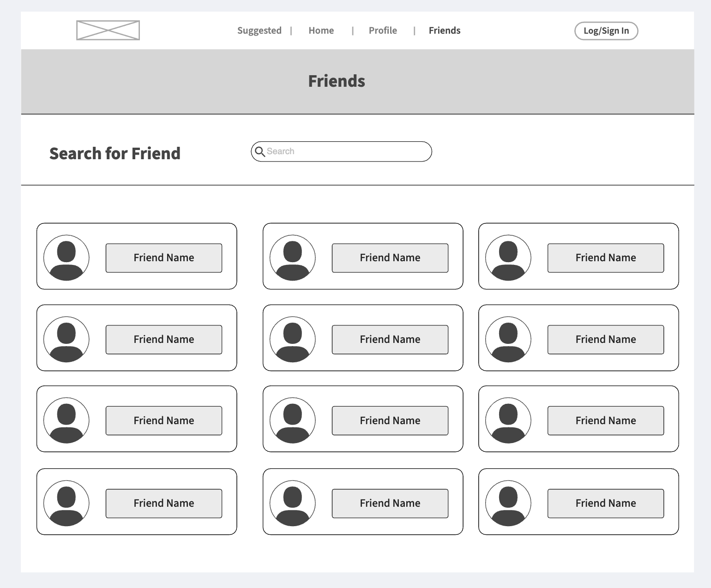

# LinkLocal
Repository for capstone project. Geospatial social media for everyone.

# Overview

**People Connection** is a web application designed to facilitate connections and activities among friends when they are geographically close. It uses geolocation and mapping technology to notify users when friends are nearby, enabling them to plan activities and meetups. The app addresses the challenge of coordinating spontaneous meetups and activities among friends who are in close proximity but may not be aware of each other's presence, as well as allows users in new areas to have the knowledge of an experienced local.

- **Category:** Social Networking  
- **Story:** Users sign up and create profiles. The app notifies them when friends are nearby, allowing them to view and join activities. Users can also create and share their own activities, connect with local guides, and participate in community discussions.  
- **Market:** Social individuals who enjoy spontaneous meetups and activities, likely targeting young adults who are tech-savvy and socially active.  
- **Habit:** The app is designed for frequent use, potentially daily, as users check for nearby friends and activities, plan meetups, and engage with community content.  
- **Scope:** Initially, the app focuses on geolocation-based social networking, including media posting and sharing by users. It may expand to include more advanced features like AI-driven recommendations and business partnerships.

---

# Product Spec

Based on the app description, this section goes into more detail about what the app should do, and what functionalities it must provide to the users.

---

# User Stories

User stories are actions that the user should be able to perform in your app.

First, focus and identify functionality that is required for your **MVP (Minimum Viable Product)** that conforms to all the project requirements and expectations. Make sure your technical challenges are part of your MVP.

You should also identify optional / nice-to-have functionalities that would be done as stretch goals during MU Week 8 and 9. Remember, technical challenges should **not** be optional features; they must be code complete before the end of Week 8!

---

## User Roles:

- **“tourist”**: a user who is looking for activities in a new area  
- **“friend”**: a user who is meeting with connections in an area

---

## Required

- User can create an account  
- User can sign up with email and password  
- User can verify their email address  
- User data - including personal information and events - stored in PostgreSQL DB  
- User can login  
- User can log in with their email and password  
- User can stay logged in across sessions  
- User can view a map of nearby activities and users  
- User can see a map view of activities and users in their area  
- User can zoom in and out of the map to explore different areas  
- Get directions and accurate map - Google Maps API  
- User can search for specific activities or locations  
- User can enter keywords to search for activities or locations  
- User can filter search results by distance, category, or rating  
- User can create and upload activity listings  
- User can create a new activity listing with description, images, and tags  
- User can upload activity listings to the platform  
- User can view activities  
- User can view details of an activity, including description, location, and time  
- User can connect with friends and see their activities  
- User can add friends to their network  
- User can see their friends' activities  
- User can receive push notifications when friends are nearby or enter an area  
- User can customize notification settings and preferences  
- User can view their profile and activity history  
- User can see their profile information, including name, email, and activity history  
- User can edit their profile information

---

## Optional

- User can integrate with popular social media platforms  
- User can share activity listings and connect with friends on social media platforms  
- User can use social media APIs to fetch user data and improve recommendations  
- User can pay/subscribe to locals for exclusive events  
- User can purchase subscriptions to access exclusive events and activities  
- User can partner with local businesses to offer premium experiences  
- Businesses can post activities in their area  
- Businesses can create activity listings and promote their services  
- Businesses can implement a review system to ensure high-quality business listings  
- User can chat with friends and plan activities using text input  
- User can develop a conversational AI chatbot  
- User can enable users to plan trips and activities using text input  
- User can see personalized recommendations based on their interests and location  
- User can develop a recommendation engine using collaborative filtering or content-based filtering  
- User can suggest activities based on user interests, location, and past interactions

---

# Screen Archetypes

- **Home Page:**  
  - Map list of nearby people  
  - Big button to encourage users to create event  
  - Friends nearby notification
 

- **Suggested Page:**  
  - Grid or carousel showcasing 3–4 suggested events/friends with images, titles, and brief descriptions
  

- **Create Event Page:**  
  - Form to input details — name, date, time, location, and description
 

- **Profile Page:**  
  - User information — editable  
  - List of all user-created events and friends list
 

- **Friends Page:**  
  - List of friends
  - Search form to find new friends
  

- **Event Page:**  
  - Detailed view of a certain event  
  - Many use cases and highly modular
  

---

# Data Model

### Users Table

- `ID`: Unique identifier for each user  
- `Name`: Store the user's name  
- `Email`: For login  
- `Password`: Hashed and salted for security  
- `Avatar`: URL or binary data for the user's profile picture  
- `Location (GeoJSON)`: Current or default location of the user  
- `Friends (ID)`: Store friend relationships via IDs (many-to-many, stored in a separate table)  
- `Preferences Data`: Used for personalizing recommendations  
- `Events (ID)`: References to event IDs user has created or joined (many-to-many)
- `Liked Events (ID)`: References to event IDs user has liked (many-to-many)

### Events Table

- `ID`: Unique identifier for each event  
- `User who posted (ID)`: Foreign key reference to creator  
- `Images`: URLs or binary data for event images  
- `Text Description`: Detailed event description  
- `GeoJSON Data`: Location info for mapping
- `Liked By (ID)`: References to user IDs that have liked the event (many-to-many)

---

# Database

- **PostgreSQL** with **PostGIS** for geospatial queries and map-based functionalities

---

# API

- **Google Maps API** for map rendering, directions, and geocoding

---

# Backend

- **Express.js** and **Node.js**
